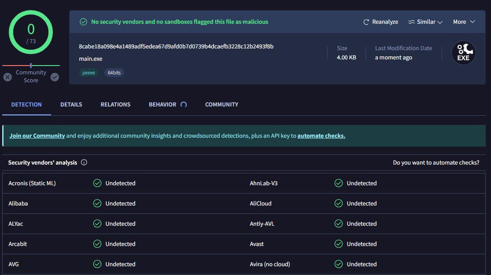

<div align="center">
  <h1>RevLink</h1>
</div>
RevConnection is an undetectable reverse shell written in C for Windows. It uses sockets to establish a connection to the attacker. And for evading detection I used the PEB structure to get the base of NTDLL and resolve the needed functions during runtime. I also used some other AV-evading techniques such as string encoding and API hashing.



## Usage
### Linux
Make sure you have python and the GNU C++ compiler\
(x86_64-w64-mingw32-g++) installed, you can compile it using the Makefile as shown below:
```
make port=<port> ip=<ip address>
```
### Windows
Make sure you have python and the GNU C++ compiler\
(x86_64-w64-mingw32-g++) installed, you can compile it using the batch file as shown below:
```
win.bat <port> <ip address>
```
\
The final executable can be found in the bin folder.

## Project Ideas & Contributions

Pull requests are welcome. For any changes.
